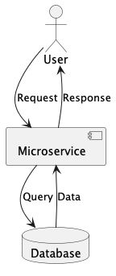

# Product API

CRUD Microservice created to manage and organize product data efficiently, with real-time currency conversion.

## Architecture


## Run instructions

**Prerequisite**: Please make sure that you have at least **Java 17** and **Docker** and **Postman** set up on your machine.

For more details like running different spring profiles or options, please look
at the [list of available Makefile commands](#makefile-commands)

```shell
# 1. Check out the project
git https://github.com/NovakVed/product-api.git
# 2. Run program
# a) Set up the infrastructure (Product API and DB)
make infra-up
# b) run dev-db and product-api service in a separate shell session to keep the output
make dev-db
make dev
```

## Makefile commands

Makefile for Product API Application Development

### Available Commands

| Command             | Description                                                                                                          |
|---------------------|----------------------------------------------------------------------------------------------------------------------|
| `make build`        | Build the project                                                                                                    |
| `make test`         | Run tests                                                                                                            |
| `make containerize` | Build the Docker image                                                                                               |
| `make infra-up`     | Set up project infrastructure using Docker Compose                                                                   |
| `make infra-down`   | Clean up project infrastructure using Docker Compose                                                                 |
| `make dev-db`       | Run only the database service from Docker Compose                                                                    |
| `make dev`          | Run in development mode (default profile: dev). Use SPRING_PROFILE to override and SPRING_PROPS for extra properties |

### Notes

- **Profiles**: Use `SPRING_PROFILE` to set a profile other than the default `development` when running `make dev`.
- **Properties**: Additional properties can be passed using the `SPRING_PROPS` variable.
- **Example**: Run with the `prod` profile:
  ```shell
  SPRING_PROFILE=prod make dev
  ```

## Available endpoints

Short summary of available endpoints in Product API, for more details and usage please visit OpenAPI documentation.

#### Product API Endpoints

| Endpoint             | Method | Description                       | Authentication | Required Fields            | Optional Fields |
|----------------------|--------|-----------------------------------|----------------|----------------------------|-----------------|
| `/v1/products`       | POST   | Create a new product              | None           | `code`, `name`, `priceEur` | `isAvailable`   |
| `/v1/products`       | GET    | Get all products                  | None           | None                       | None            |
| `/v1/producs/{code}` | GET    | Get product by code               | None           | `code`                     | None            |
| `/v1/help`           | GET    | Redirect to OpenAPI Documentation | None           | None                       | None            |

### Test Endpoints

You can use already created postman collection to test all of the above endpoints. Go to the `Postman` app and import `postman/product-api.postman_collection.json`.